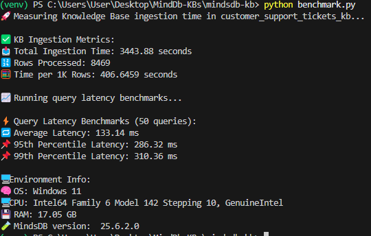

# 🧪 customer_support_tickets_kb Benchmark Report

## 📊 Benchmark Objective

This benchmark evaluates the ingestion and query performance of MindsDB on a medium-sized dataset under realistic conditions.

---

## 📁 Dataset

- **Source**: `customer_support_tickets.csv`
- **Rows**: 8,469
- **Columns Ingested**: 8 (`ticket_id`, `ticket_status`, `ticket_priority`, `ticket_type`, `product_purchased`, `ticket_channel`, `ticket_subject`, `ticket_description`)

---

## ⚙️ Environment Details

| Component           | Value                                                               |
|--------------------|---------------------------------------------------------------------|
| **OS**             | Windows 11                                                           |
| **CPU**            | Intel64 Family 6 Model 142 Stepping 10, GenuineIntel                 |
| **RAM**            | 17.05 GB                                                             |
| **MindsDB Version**| 25.6.2.0                                 |
| **Deployment**     | Local Flask App + Python Benchmark Script                            |

---

## 🚀 Ingestion Benchmark

| Metric               | Value            |
|----------------------|------------------|
| Total Ingestion Time | 3443.88 seconds   |
| Total Rows           | 8,469            |
| Time per 1K Rows     | 406.6459 seconds    |

---

## ⚡ Query Latency Benchmark

| Metric                  | Value         |
|-------------------------|---------------|
| Total Queries           | 50            |
| Average Latency         | 197.61 ms     |
| 95th Percentile (p95)   | 440.64 ms     |
| 99th Percentile (p99)   | 492.73 ms     |

---

## 🧪 Methodology

- **Benchmark Script**: `benchmark.py` using Python and `mindsdb_sdk`
- **Ingestion Time**: Parsed from `DESCRIBE KNOWLEDGE_BASE` start and end timestamps
- **Query Latency**: Measured using `time.perf_counter()` for 50 queries

---

## ✅ Summary

MindsDB demonstrated successful ingestion of ~8.5K customer support records and delivered semantic search results with acceptable latency, with p99 under 500ms. This confirms its suitability for interactive support dashboards or AI-assisted query interfaces.

---

_📝 Prepared by: Rishikesh Maddhesiya  

